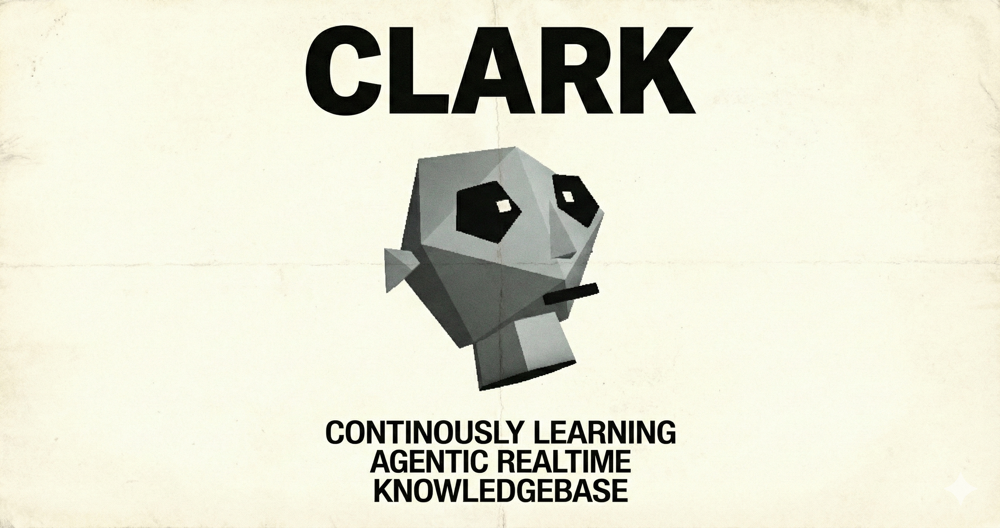

# ClarkOS Example Agent



**C**ontinuously **L**earning **A**gentic **R**ealtime **K**nowledgebase

[](https://github.com/clarkOS/clark)
[](https://clark.wiki)
[](https://docs.clarkos.dev)
[](https://x.com/clarkwiki)

A serverless autonomous agent framework powered by [Convex](https://convex.dev). Build agents that operate continuously, maintain persistent memory, and evolve through autonomous tick cycles.

---

## One-Click AI Setup

Copy this prompt into **Claude Code**, **Cursor**, **Windsurf**, or any AI coding assistant:

<details>
<summary><b>Click to expand prompt</b></summary>

```
Set up ClarkOS - an autonomous agent framework with persistent memory.

## Repository
Clone: https://github.com/clarkOS/clark
Docs: https://docs.clarkos.dev

## Steps
1. git clone https://github.com/clarkOS/clark && cd clark/example/convex
2. npm install
3. npm run doctor (validate environment)
4. npm run demo (no API keys needed)

## For Full Mode
Create .env.local with:
- CONVEX_URL=https://your-project.convex.cloud (run: npx convex dev)
- OPENROUTER_KEY=your-key (from openrouter.ai)
- GEMINI_API_KEY=your-key (from aistudio.google.com/apikey - free)

Then: npm run dev

## Architecture
- Runtime: Node.js 18+ TypeScript
- Backend: Convex serverless (realtime, transactional)
- LLM: OpenRouter/OpenAI/Anthropic
- Embeddings: Gemini (free) or OpenAI
- UI: React Ink terminal

## Core Concepts
- Tick System: Continuous heartbeat execution (not request-response)
- 5 Memory Types: episodic (0.92), semantic (0.95), emotional (0.88), procedural (0.97), reflection (0.90) - numbers are dedup thresholds
- Agent State: mood, health (0-100), routine (morning/day/evening/overnight), volatility, cryo
- Plugin System: lifecycle hooks (init, cleanup, onTick)

## Key Files
- src/core/agent.ts - Agent runtime
- src/core/tick.ts - Tick execution
- src/memory/store.ts - Memory operations
- src/memory/deduplication.ts - Similarity checks
- src/plugins/loader.ts - Plugin system
- convex/schema.ts - Database schema
- convex/http.ts - API endpoints

## API Endpoints
GET /health, /state, /memories, /memories/core, /memories/stats, /knowledge, /logs
POST /memories, /knowledge

## Basic Usage
import { Agent, ConvexBackend } from './src';
const agent = new Agent({ backend: new ConvexBackend({ url: process.env.CONVEX_URL! }) });
await agent.tick();

## Plugin Example
const plugin = { name: 'my-plugin', version: '1.0.0', onTick(ctx) { console.log(ctx.state.mood); } };
agent.use(plugin);

## Tests
npm test (179 tests across 7 modules)

Help me get this running and explore the codebase.
```

</details>

---

## Features

- **Tick-Based Execution**: Continuous heartbeat, not request-response
- **5 Memory Types**: Episodic, semantic, emotional, procedural, reflection
- **Type-Specific Deduplication**: Tuned similarity thresholds per memory type
- **Multi-Provider LLM**: OpenRouter, OpenAI, Anthropic, or custom
- **Convex Backend**: Realtime, transactional, serverless
- **Plugin System**: Lifecycle hooks and callable actions
- **Terminal UI**: React Ink interface
- **179 Tests**: Comprehensive test coverage

---

## Quick Start

### 1. Clone & Install

```bash
git clone https://github.com/clarkOS/clark
cd clark/example/convex
npm install
```

### 2. Validate Environment

```bash
npm run doctor
```

### 3. Try Demo Mode (No API Keys)

```bash
npm run demo
```

### 4. Or Configure Full Mode

```bash
cp .env.example .env.local
```

Edit `.env.local`:

```bash
CONVEX_URL=https://your-project.convex.cloud
OPENROUTER_KEY=your_openrouter_api_key
GEMINI_API_KEY=your_gemini_api_key
```

Run:

```bash
npm run dev
```

---

## Usage

### Basic Agent

```typescript
import { Agent, ConvexBackend } from './src';

const agent = new Agent({
  backend: new ConvexBackend({
    url: process.env.CONVEX_URL!,
  }),
});

// Execute a single tick
await agent.tick();

// Get current state
const state = await agent.getState();
console.log(`Mood: ${state.mood}, Health: ${state.health}`);
```

### Memory Operations

```typescript
// Store a memory (with automatic deduplication)
await agent.memory.store({
  content: 'Discovered a new pattern in user behavior',
  type: 'episodic',
  importance: 0.7,
  tags: ['insight', 'users'],
});

// Semantic search
const results = await agent.memory.search({
  query: 'user behavior patterns',
  limit: 5,
});
```

### Plugins

```typescript
import type { Plugin } from './src/plugins';

const myPlugin: Plugin = {
  name: 'logger',
  version: '1.0.0',

  init(agent) {
    console.log('Plugin initialized');
  },

  onTick(context) {
    console.log(`Mood: ${context.state.mood}, Health: ${context.state.health}`);
  },
};

agent.use(myPlugin);
```

---

## Architecture

```
┌─────────────────────────────────────────────────────────────────┐
│                        Agent Runtime                            │
├────────────────┬────────────────┬───────────────────────────────┤
│   Tick System  │  Memory System │      Knowledge Base           │
│   (heartbeat)  │   (5 types)    │    (facts, news, notes)       │
├────────────────┼────────────────┼───────────────────────────────┤
│      LLM       │   Embeddings   │      Deduplication            │
│ (multi-provider) │  (semantic)   │  (type-specific thresholds)   │
├────────────────┴────────────────┴───────────────────────────────┤
│                       Plugin System                             │
│              (lifecycle hooks, actions, services)               │
├─────────────────────────────────────────────────────────────────┤
│                  Convex (State Machine)                         │
│        realtime data + events + durable state                   │
└─────────────────────────────────────────────────────────────────┘
```

### Memory Types

| Type | Purpose | Dedup Threshold |
|------|---------|-----------------|
| `episodic` | Events and experiences | 0.92 |
| `semantic` | Facts and concepts | 0.95 |
| `emotional` | Feelings about topics | 0.88 |
| `procedural` | Learned patterns | 0.97 |
| `reflection` | Metacognitive insights | 0.90 |

### Agent State

```typescript
interface AgentState {
  mood: 'neutral' | 'expressive' | 'curious' | 'excited' | 'reflective' | 'concerned';
  health: number;      // 0-100, drifts toward equilibrium
  routine: 'morning' | 'day' | 'evening' | 'overnight';
  volatility: number;  // 0-1, behavioral variance
  cryo: boolean;       // hibernation mode
}
```

---

## API Endpoints

| Endpoint | Method | Description |
|----------|--------|-------------|
| `/health` | GET | Health check |
| `/state` | GET | Current agent state |
| `/memories` | GET | List memories |
| `/memories` | POST | Store memory |
| `/memories/core` | GET | Core memories |
| `/memories/stats` | GET | Memory statistics |
| `/knowledge` | GET | List knowledge |
| `/knowledge` | POST | Add knowledge |
| `/logs` | GET | Activity logs |

---

## Configuration

### LLM Providers

```bash
# OpenRouter (recommended)
LLM_PROVIDER=openrouter
OPENROUTER_KEY=your_key

# OpenAI
LLM_PROVIDER=openai
OPENAI_API_KEY=your_key

# Anthropic
LLM_PROVIDER=anthropic
ANTHROPIC_API_KEY=your_key
```

### Embedding Providers

```bash
# Gemini (recommended - free tier)
EMBEDDING_PROVIDER=gemini
GEMINI_API_KEY=your_key

# OpenAI
EMBEDDING_PROVIDER=openai
OPENAI_API_KEY=your_key
```

---

## Testing

```bash
npm test
```

**179 tests** across 7 modules:
- `core/tick` - Tick system (25 tests)
- `core/config` - Configuration (22 tests)
- `memory/deduplication` - Deduplication logic (34 tests)
- `backend/memory` - Backend operations (22 tests)
- `plugins/loader` - Plugin system (26 tests)
- `llm/embeddings` - Embeddings (32 tests)
- `services/news` - Services (21 tests)

---

## Project Structure

```
convex/                  # Convex backend
├── schema.ts            # Database schema
├── http.ts              # HTTP endpoints
├── state.ts             # State queries/mutations
├── memories.ts          # Memory operations
├── knowledge.ts         # Knowledge operations
└── logs.ts              # Logging

src/
├── cli.tsx              # CLI entry point
├── core/                # Agent runtime, tick system
├── memory/              # Memory store, deduplication
├── knowledge/           # Knowledge base
├── plugins/             # Plugin system
├── llm/                 # LLM & embedding clients
├── services/            # Background services
├── templates/           # Prompt templates
└── ui/                  # Terminal UI (Ink + React)

tests/                   # Jest tests (179 total)
```

---

## Links

| Resource | URL |
|----------|-----|
| GitHub | [github.com/clarkOS/clark](https://github.com/clarkOS/clark) |
| Documentation | [docs.clarkos.dev](https://docs.clarkos.dev) |
| Live Demo | [clark.wiki](https://clark.wiki) |
| X / Twitter | [@clarkwiki](https://x.com/clarkwiki) |

---

## License

MIT
